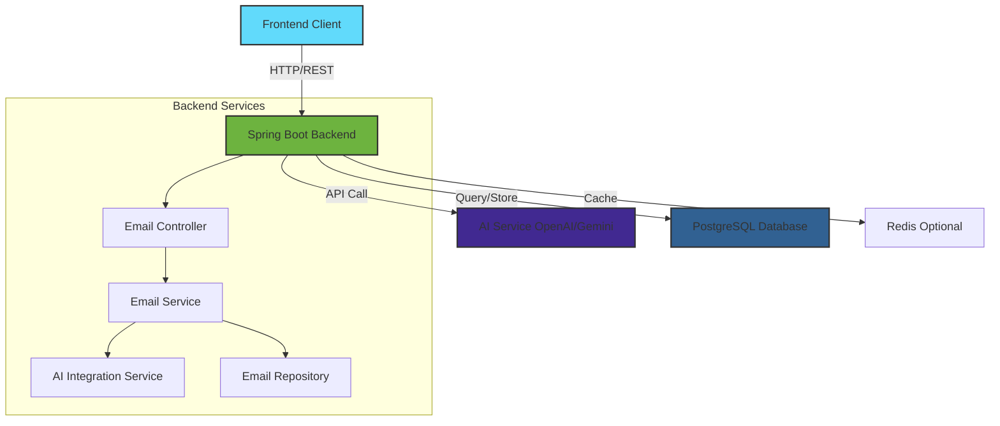

# AI Email Assistant Backend

A Spring Boot-based backend service that powers an AI-driven email assistant. This application helps generate intelligent email responses, manage email workflows, and provide automated email assistance using AI capabilities.

## 🛠️ Tech Stack

<div align="center">

### Backend Framework


### AI & APIs


### Database & Tools


### Development Tools


</div>

## 🚀 Features

- **AI-Powered Email Generation**: Generate professional email responses using AI
- **Multiple Tone Support**: Support for various email tones (Professional, Casual, Friendly, etc.)
- **RESTful API**: Clean and well-documented REST endpoints
- **Spring Boot Framework**: Built on robust Spring Boot architecture
- **Maven Build System**: Easy dependency management and build process

## 📋 Prerequisites

Before you begin, ensure you have the following installed:

- **Java JDK 17+** (or compatible version)
- **Maven 3.6+**
- **PostgreSQL 12+**
- **Git**
- An **AI API Key** (e.g., OpenAI, Google Gemini, or similar)

## 🛠️ Installation

### 1. Clone the Repository

```bash
git clone https://github.com/arindamdandapat11/Ai_email_assistant_backend.git
cd Ai_email_assistant_backend
```

### 2. Configure Environment Variables

Create a `.env` file in the project root or configure `application.properties`:

```properties
# AI API Configuration
AI_API_KEY=your_api_key_here
AI_MODEL=gpt-4  # or your preferred model

# Database Configuration
DB_HOST=localhost
DB_PORT=5432
DB_NAME=email_assistant_db
DB_USERNAME=your_db_username
DB_PASSWORD=your_db_password

# Server Configuration
server.port=8080

# CORS Configuration (adjust for your frontend URL)
cors.allowed.origins=http://localhost:3000
```

### 3. Setup PostgreSQL Database

Create the database:

```sql
CREATE DATABASE email_assistant_db;
CREATE USER your_db_username WITH PASSWORD 'your_db_password';
GRANT ALL PRIVILEGES ON DATABASE email_assistant_db TO your_db_username;
```

### 4. Install Dependencies

Using Maven Wrapper (recommended):

```bash
./mvnw clean install
```

Or using Maven directly:

```bash
mvn clean install
```

## 🚦 Running the Application

### Development Mode

```bash
./mvnw spring-boot:run
```

Or:

```bash
mvn spring-boot:run
```

The server will start on `http://localhost:8080` by default.

### Production Build

```bash
./mvnw clean package
java -jar target/ai-email-assistant-backend-*.jar
```

## 📡 API Endpoints

### Generate Email Response

**POST** `/api/email/generate`

Generates an AI-powered email response based on the input.

**Request Body:**
```json
{
  "originalEmail": "The email content to respond to",
  "tone": "professional",
  "context": "Optional additional context"
}
```

**Response:**
```json
{
  "generatedResponse": "AI-generated email response",
  "tone": "professional",
  "timestamp": "2024-12-12T10:30:00Z"
}
```

### Health Check

**GET** `/api/health`

Returns the health status of the application.

## 🏗️ Project Structure

```
Ai_email_assistant_backend/
├── src/
│   ├── main/
│   │   ├── java/
│   │   │   └── com/
│   │   │       └── emailassistant/
│   │   │           ├── controller/    # REST controllers
│   │   │           ├── service/       # Business logic
│   │   │           ├── model/         # Data models
│   │   │           ├── config/        # Configuration classes
│   │   │           └── util/          # Utility classes
│   │   └── resources/
│   │       ├── application.properties
│   │       └── static/
│   └── test/
│       └── java/                       # Unit tests
├── .mvn/
├── pom.xml                             # Maven configuration
├── .env                                # Environment variables
├── .gitignore
└── README.md
```

## 🎯 Architecture

<div align="center">



</div>

## 🔧 Configuration

### Application Properties

Edit `src/main/resources/application.properties`:

```properties
# Application Name
spring.application.name=ai-email-assistant-backend

# Server Port
server.port=8080

# PostgreSQL Database Configuration
spring.datasource.url=jdbc:postgresql://localhost:5432/email_assistant_db
spring.datasource.username=your_db_username
spring.datasource.password=your_db_password
spring.datasource.driver-class-name=org.postgresql.Driver

# JPA/Hibernate Configuration
spring.jpa.hibernate.ddl-auto=update
spring.jpa.show-sql=true
spring.jpa.properties.hibernate.dialect=org.hibernate.dialect.PostgreSQLDialect
spring.jpa.properties.hibernate.format_sql=true

# AI Service Configuration
ai.service.endpoint=https://api.openai.com/v1
ai.service.model=gpt-4
ai.service.max-tokens=1000
ai.service.temperature=0.7

# CORS Configuration
spring.web.cors.allowed-origins=http://localhost:3000,https://yourdomain.com
spring.web.cors.allowed-methods=GET,POST,PUT,DELETE,OPTIONS
spring.web.cors.allowed-headers=*
```

## 🧪 Testing

Run unit tests:

```bash
./mvnw test
```

Run tests with coverage:

```bash
./mvnw test jacoco:report
```

## 🐳 Docker Deployment

### Build Docker Image

```dockerfile
# Dockerfile example
FROM openjdk:17-jdk-slim
WORKDIR /app
COPY target/*.jar app.jar
EXPOSE 8080
ENTRYPOINT ["java", "-jar", "app.jar"]
```

Build and run:

```bash
docker build -t ai-email-assistant-backend .
docker run -p 8080:8080 --env-file .env ai-email-assistant-backend
```

## 🌐 Integration with Frontend

This backend is designed to work with a frontend application. Configure CORS settings to allow your frontend domain:

```java
@Configuration
public class CorsConfig {
    @Bean
    public WebMvcConfigurer corsConfigurer() {
        return new WebMvcConfigurer() {
            @Override
            public void addCorsMappings(CorsRegistry registry) {
                registry.addMapping("/api/**")
                        .allowedOrigins("http://localhost:3000")
                        .allowedMethods("GET", "POST", "PUT", "DELETE");
            }
        };
    }
}
```

## 🔐 Security Considerations

- **API Keys**: Never commit API keys to version control
- **Environment Variables**: Use `.env` file or environment variables for sensitive data
- **HTTPS**: Use HTTPS in production
- **Rate Limiting**: Implement rate limiting to prevent abuse
- **Input Validation**: Always validate and sanitize user inputs

## 📝 Environment Variables

| Variable | Description | Required | Default |
|----------|-------------|----------|---------|
| `AI_API_KEY` | API key for AI service | Yes | - |
| `AI_MODEL` | AI model to use | No | gpt-4 |
| `DB_HOST` | PostgreSQL host | Yes | localhost |
| `DB_PORT` | PostgreSQL port | Yes | 5432 |
| `DB_NAME` | Database name | Yes | email_assistant_db |
| `DB_USERNAME` | Database username | Yes | - |
| `DB_PASSWORD` | Database password | Yes | - |
| `SERVER_PORT` | Server port | No | 8080 |
| `CORS_ORIGINS` | Allowed CORS origins | No | * |

## 🤝 Contributing

1. Fork the repository
2. Create a feature branch (`git checkout -b feature/AmazingFeature`)
3. Commit your changes (`git commit -m 'Add some AmazingFeature'`)
4. Push to the branch (`git push origin feature/AmazingFeature`)
5. Open a Pull Request

## 📜 License

This project is licensed under the MIT License - see the LICENSE file for details.

## 👤 Author

**Arindam Dandapat**
- GitHub: [@arindamdandapat11](https://github.com/arindamdandapat11)

## 🐛 Troubleshooting

### Common Issues

**Issue**: Application fails to start
- **Solution**: Ensure Java 17+ is installed and JAVA_HOME is set correctly

**Issue**: Database connection failed
- **Solution**: Verify PostgreSQL is running and credentials in `.env` are correct. Check if the database exists.

**Issue**: AI API calls failing
- **Solution**: Verify your API key is correct and has sufficient credits/quota

**Issue**: CORS errors
- **Solution**: Check that your frontend URL is added to allowed origins

**Issue**: Port already in use
- **Solution**: Change the port in `application.properties` or stop the conflicting service

**Issue**: Hibernate schema generation errors
- **Solution**: Ensure PostgreSQL user has proper permissions. Try setting `spring.jpa.hibernate.ddl-auto=create` for first run.

## 📚 Additional Resources

- [Spring Boot Documentation](https://spring.io/projects/spring-boot)
- [Maven Documentation](https://maven.apache.org/guides/)
- [OpenAI API Documentation](https://platform.openai.com/docs)

## 🗺️ Roadmap

- [ ] Add email scheduling functionality
- [ ] Implement email template management
- [ ] Add support for multiple AI providers
- [ ] Implement caching for frequently used responses
- [ ] Add email analytics and insights
- [ ] Support for attachments processing

## 💬 Support

For support, email arindamdandapat11@example.com or open an issue in the GitHub repository.

---

**Note**: This is a backend service and requires a corresponding frontend application to provide a complete user interface. Make sure to check the frontend repository for the complete solution.
